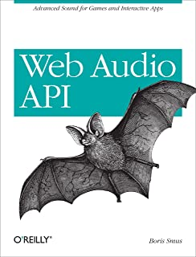
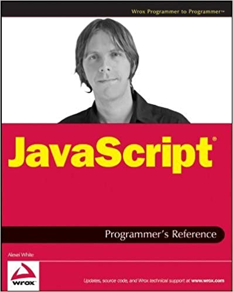

## Resources

- [12 Books Every JavaScript Developer Should Read by Eric Eliott](https://medium.com/javascript-scene/12-books-every-javascript-developer-should-read-9da76157fb3)
- [Top 20 of Best JavaScript Books Recommended Most Times by Javascript Pros](https://www.blog.consultants500.com/web-mobile-design-and-development/top-20-best-javascript-book-recommended-times-javascript-pros/)

## The List

- **JavaScript for Kids: A Playful Introduction to Programming** by _Nick Morgan_

&nbsp;

- Composing Software by _Eric Elliott_

&nbsp;

- **Eloquent JavaScript: A Modern Introduction to Programming** by _Marijn Haverbeke_

&nbsp;

- **JavaScript: The Good Parts** by _Douglas Crockford_

&nbsp;

- **Programming JavaScript Applications: Robust Web Architecture with Node, HTML5, and Moderns JS Libraries** by _Eric Elliott_

&nbsp;

- **Effective JavaScript: 68 Specific Ways to Harness the Power of JavaScript** by _David Herman_

&nbsp;

- **JavaScript: The Definitive Guide** by _David Flanagan_

&nbsp;

- **You Don’t Know JS** by _Kyle Simpson_
| [Free First Edition Online Book](https://github.com/getify/You-Dont-Know-JS/blob/1st-ed/README.md)
| [Free Second Edition Online Book](https://github.com/getify/You-Dont-Know-JS)

&nbsp;

- **JavaScript Allongé: The Six Edition** by _Reginald Braithwaite_ | [Free Book Online](https://leanpub.com/javascriptallongesix/read)

&nbsp;

- Node.js in Action _by Mike Cantelon, Marc Harter, TJ Holowaychuk, and Nathan Rajlich_

&nbsp;

&nbsp;

- **High Performance Browser Networking** by _Ilya Grigorik_
| [Free Book Online](https://hpbn.co/)

&nbsp;

- Web Audio API by _Boris Smus_

&nbsp;

- JavaScript Patterns: Build Better Applications with Coding and Design Patterns by _Stoyan Stefanov_

&nbsp;

- Beginning JavaScript And CSS Development with jQuery by _Richard York_

&nbsp;

- JavaScript Programmer’s Reference by _Alexei White_

&nbsp;

- Secrets of the JavaScript Ninja by _John Resig and Bear Bibeault_

&nbsp;

&nbsp;

- Learning Javascript Design Patterns by _Addy Osmani_

&nbsp;

- High Performance JavaScript by _Nicholas C. Zakas_

&nbsp;

