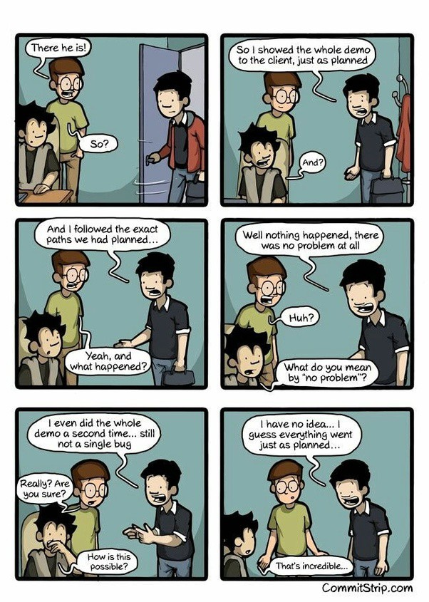

## Resources

- [Best Programming Jokes](http://www.devtopics.com/best-programming-jokes/)
- [30 Jokes Only Programmers Will Get](https://hackernoon.com/30-jokes-only-programmers-will-get-a901e1cea549)
- [Programming Jokes: Top 20 Funniest Jokes Only Programmers will get](https://www.thecoderpedia.com/blog/programming-jokes/)
- [What's the best programming joke that you know?](https://www.reddit.com/r/AskReddit/comments/1kvhmz/whats_the_best_programming_joke_that_you_know/)

## Jokes

### VPN


### Loops

```
Q. How did the programmer die in the shower?
A. He read the shampoo bottle instructions: Lather. Rinse. Repeat.
```

```
A Programmer was walking out of door for work, his wife said “while you’re out, buy some milk” and he never came home.

ps. That took me a while to get.
```

### Light bulb

```
How many programmers does it take to change a light bulb?
None – It’s a hardware problem
```

### Java

```
“Knock, knock.”
“Who’s there?”
very long pause….
“Java.”
```

```
Some people see a problem and think "I know, I'll use Java!". Now they have a ProblemFactory.
```

```
Q: Why do Java programmers wear glasses?

A: Because they don't C#!
```

### Warnings

```
A man is smoking a cigarette and blowing smoke rings into the air.  His girlfriend becomes irritated with the smoke and says, “Can’t you see the warning on the cigarette pack?  Smoking is hazardous to your health!”

To which the man replies, “I am a programmer.  We don’t worry about warnings; we only worry about errors.”
```

### npm

```
1/3 of US bandwith is used by Netflix...

the rest is used by `rm -rf node_modules && npm install`
```

### Logical operators

```
GF: All you ever talk about is Programming Jokes! I am sick of it! It’s me or your Programming Jokes!
Me: You meant to say it’s you XOR my Programming Jokes.
GF: I am leaving you.
```

### Race Conditions

```
Knock knock.

Race condition.

Who's there?
```

### TCP / UDP

```
What's the best part about TCP jokes?

I get to keep telling them until you get them.

ps. I've got a really good UDP joke to tell you, but I don't know if you'll get it
```

### if / else

```
A programmer puts two glasses on his bedside table before going to sleep. A full one, in case he gets thirsty, and an empty one, in case he doesn’t.
```

### Management

```
A man flying in a hot air balloon suddenly realizes he’s lost. He reduces height and spots a man down below. He lowers the balloon further and shouts to get directions, "Excuse me, can you tell me where I am?"

The man below says: "Yes. You're in a hot air balloon, hovering 30 feet above this field."

"You must work in Information Technology," says the balloonist.

"I do" replies the man. "How did you know?"

"Well," says the balloonist, "everything you have told me is technically correct, but It's of no use to anyone."

The man below replies, "You must work in management."

"I do," replies the balloonist, "But how'd you know?"*

"Well", says the man, "you don’t know where you are or where you’re going, but you expect me to be able to help. You’re in the same position you were before we met, but now it’s my fault."
```

### Octals

```
Why do programmers confuse halloween and christmas? Because Oct 31 = Dec 25.
```

### Naming

```
Two programmers get into a foo
```

### Project Management

```
Q: What did the Project Manager say to the Programmer?

A: You start coding, I'll go find out what they want.
```

```
At a recent computer software engineering management course, the participants were given an awkward question to answer:

"If you had just boarded an airliner and discovered that your team of programmers had been responsible for the flight control software, how many of you would disembark immediately?"

Among the ensuing forest of raised hands only one man sat motionless. When asked what he would do, he replied that he would be quite content to stay aboard. With his team's software, he said, the plane was unlikely to even taxi as far as the runway, let alone take off.
```

### Demos


