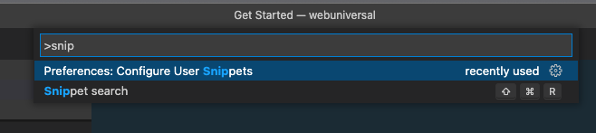
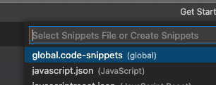
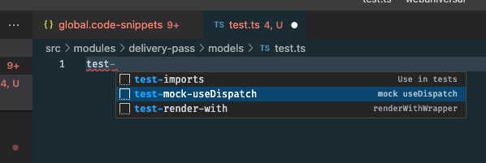

## Creating or Editing the snippets

In order to create or edit snippets go to preferences:



I chose to edit the most generic file so I can reuse the snippet between `.js, .jsx, .ts, .tsx`.



```json
{
   "mock useDispatch with spyOn": {
    "prefix": "test-spyOn-useDispatch",
    "body": [
      "import * as reactRedux from 'react-redux';",
      "",
      "const useDispatchSpy = jest.spyOn(reactRedux, 'useDispatch')",
      "const mockedDispatch = jest.fn()",
      "useDispatchSpy.mockImplementation(() => mockedDispatch)"
    ],
    "description": "mock use dispatch with spyOn"
  },
}
```

```jsx
import * as reactRedux from 'react-redux';

const useDispatchSpy = jest.spyOn(reactRedux, 'useDispatch')
const mockedDispatch = jest.fn()
useDispatchSpy.mockImplementation(() => mockedDispatch)
```

## Using the snippets

Start typing and use `tab` and `autocomplete`.



##  Official docs

[https://code.visualstudio.com/docs/editor/userdefinedsnippets#:~:text=You%20can%20search%20for%20extensions,new%20snippets%20will%20be%20available.](https://code.visualstudio.com/docs/editor/userdefinedsnippets#:~:text=You%20can%20search%20for%20extensions,new%20snippets%20will%20be%20available.)