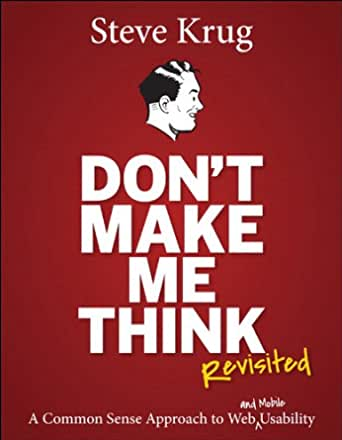
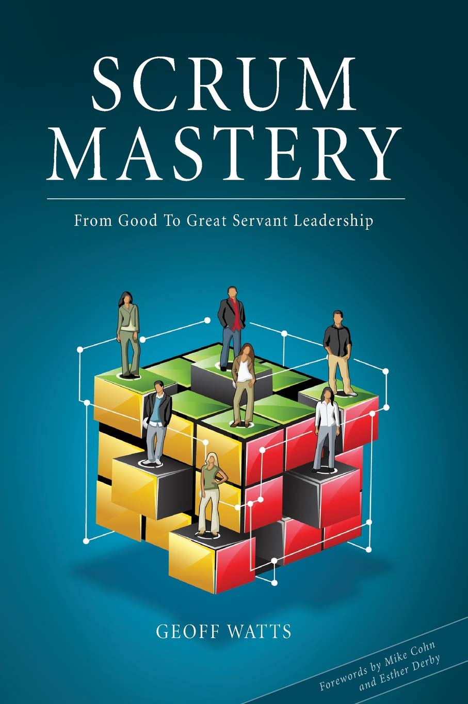
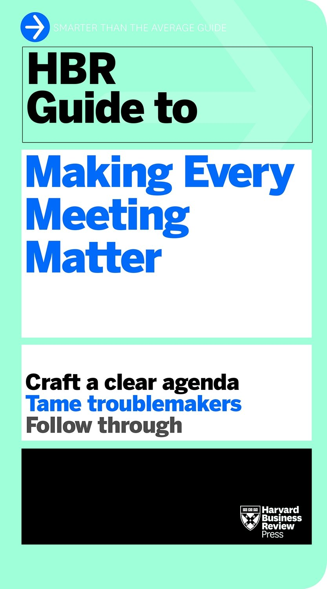
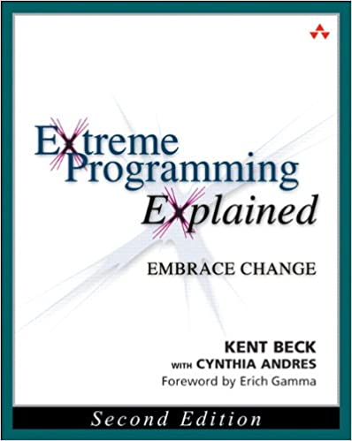
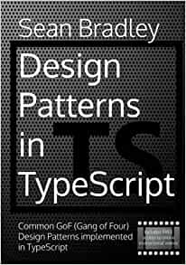
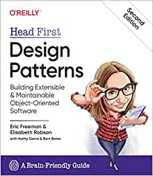
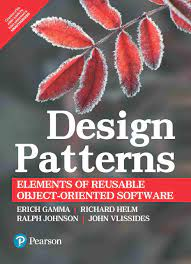

Universal Principles of Design

Don't make me think

Haz fácil lo imposible

Eloquent Javascript

Las leyes de la simplicidad

Scrum Mastery 

Making every meeting matter

Refactoring

Extreme Programming Explained

Agile Software Development

Design Patters in Typescript

Head First Design Patterns

Design Patterns
